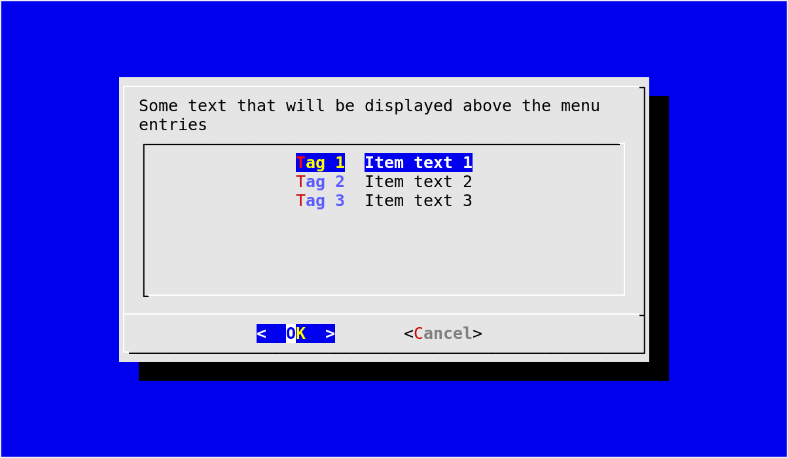
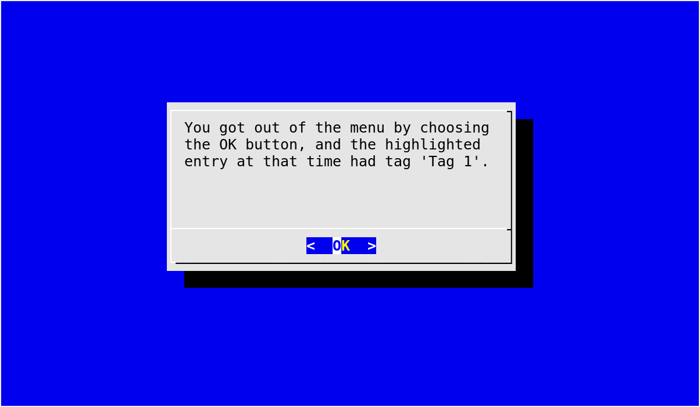
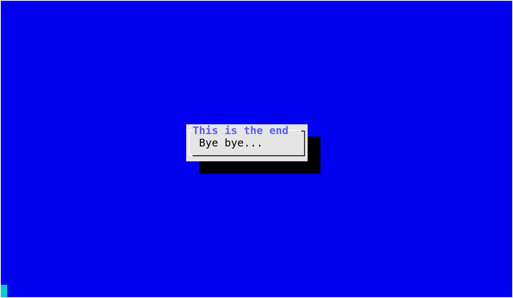

.. currentmodule:: dialog

A gentle introduction
=====================

A minimal program using pythondialog starts with the creation of a
:class:`Dialog` instance::

  from dialog import Dialog

  d = Dialog(dialog="dialog")

The *dialog* parameter indicates the executable to use to invoke the backend
(which must be compatible with dialog_). For instance, one might use something
like ``dialog="/home/dave/src/dialog-1.2-20140219/dialog"``. The default value
is ``"dialog"``, and since it does not contain any slash (``/``), it is looked
up according to the :envvar:`PATH` environment variable. See
:meth:`Dialog.__init__` for a description of all parameters that can be passed
to the :class:`Dialog` constructor.

.. _dialog: https://invisible-island.net/dialog/dialog.html

Offering a choice between several options using :meth:`!menu`
-------------------------------------------------------------

Once you have a :class:`Dialog` instance, you can call any widget-producing
method, as documented in :ref:`widgets`. For instance, if you want to display
a menu offering three choices::

  code, tag = d.menu("Some text that will be displayed above the menu entries",
                     choices=[("Tag 1", "Item text 1"),
                              ("Tag 2", "Item text 2"),
                              ("Tag 3", "Item text 3")])

When the method returns:

  - *code* will be equal to ``d.OK`` if there was no error and the user chose
    an entry (instead of pressing :kbd:`Esc`). See :ref:`Dialog-exit-code` for
    more details on how to interpret the value of *code*.
  - *tag* will contain the name of the tag corresponding to the selected
    entry: ``"Tag 1"``, ``"Tag 2"`` or ``"Tag 3"`` (assuming that ``code ==
    d.OK``).

While we kept this :meth:`~Dialog.menu` example as simple as possible, it
would be very easy to add a title line at the top of the widget window. For
this, all you need to do is to add a :samp:`title={...}` keyword argument to
the :meth:`~!Dialog.menu` method call. It is also possible to display a
background title using :samp:`backtitle={...}`, and in case you want the same
background title for all widgets, :meth:`Dialog.set_background_title` is your
friend.

   A simple example using :meth:`Dialog.menu`

Displaying a message with :meth:`~!Dialog.msgbox`
-------------------------------------------------

We can expand on the previous example by displaying an :meth:`~Dialog.msgbox`
indicating what the user has done to exit from the :meth:`~Dialog.menu`.
First, we can define a mapping from the :term:`Dialog exit codes <Dialog exit
code>` for the standard buttons to the corresponding button labels::

  button_names = {d.OK:     "OK",
                  d.CANCEL: "Cancel",
                  d.HELP:   "Help",
                  d.EXTRA:  "Extra"}

Of course, in the previous :meth:`~Dialog.menu` widget call, the only codes
that can be returned are ``d.OK`` and ``d.CANCEL``, respectively corresponding
to the :guilabel:`OK` and :guilabel:`Cancel` buttons. Thus, we could do with
only two key-value pairs in ``button_names`` for this particular example,
however it seems cleaner and not outrageously expensive to declare the codes
for the four standard buttons like this.

In addition to these :term:`Dialog exit codes <Dialog exit code>`, the
:meth:`~Dialog.menu` widget call can return ``d.ESC``, indicating that the
user pressed the :kbd:`Esc` key. Therefore, we are going to check for this one
too. Here it goes::

  if code == d.ESC:
      d.msgbox("You got out of the menu by pressing the Escape key.")
  else:
      text = "You got out of the menu by choosing the {} button".format(
          button_names[code])

      if code != d.CANCEL:
          text += ", and the highlighted entry at that time had tag {!r}".format(
          tag)

      d.msgbox(text + ".", width=40, height=10)

(users of Python < 3.1 should replace ``{}`` with ``{0}`` and ``{!r}`` with
``{0!r}``)

The above code for dealing with the :kbd:`Esc` key is pretty straightforward.
It relies on the default values to determine the width and height of the
:meth:`~Dialog.msgbox`, which are acceptable in this case. On the other hand,
the default width for :meth:`~!Dialog.msgbox` seemed too small for the message
displayed in the *else* clause, causing very irregular line lengths. In order
to compensate for this problem, we have explicitely specified the width and
height of the :meth:`~!Dialog.msgbox` using keyword arguments
(``width=40, height=10``).

   A message displayed with :meth:`Dialog.msgbox`

Displaying a transient message with :meth:`~!Dialog.infobox`
------------------------------------------------------------

We can finish this little example with a widget call that displays a message
and immediately returns to the caller without waiting for the user to react.
Typically, the :meth:`~Dialog.infobox` is used to display some information
while  a time-consuming operation is being performed. In this case, since we
don't have anything particularly useful to do but still want the user to be
able to read the message, we are going to wait using :func:`time.sleep`::

  d.infobox("Bye bye...", width=0, height=0, title="This is the end")
  time.sleep(2)

We also addressed the problem of determining the widget size in a different
way as exposed earlier. By using ``width=0, height=0``, we ask
:program:`dialog` to automatically determine suitable width and height
parameters for the dialog box. If you like this method and would like to have
it used by default for all widgets without having to specify ``width=0,
height=0`` every time, you can enable the :ref:`autowidgetsize feature
<autowidgetsize>`.

For the sake of the example, we've also specified a window title for the
:meth:`~Dialog.infobox` using a :samp:`title={...}` keyword argument. This can
be done with most widgets, and is entirely optional.

   A transient message displayed with :meth:`Dialog.infobox`

Of course, the :func:`time.sleep` call requires an::

  import time

statement that you, careful reader, had already added. In order to exit
cleanly from our program, I also suggest to end with::

  sys.exit(0)

which requires an::

  import sys

at the top of your script. And finally, since you don't want to take bad
habits, I would also suggest starting your program with::

  locale.setlocale(locale.LC_ALL, '')

which in turn requires an::

  import locale

at the top.

Putting it all together
-----------------------

If we put all the pieces from this chapter together and reorder a tiny bit to
improve readability, we obtain the code for our example program::

  import sys
  import locale
  import time

  from dialog import Dialog

  # This is almost always a good thing to do at the beginning of your programs.
  locale.setlocale(locale.LC_ALL, '')

  d = Dialog(dialog="dialog")

  button_names = {d.OK:     "OK",
                  d.CANCEL: "Cancel",
                  d.HELP:   "Help",
                  d.EXTRA:  "Extra"}

  code, tag = d.menu("Some text that will be displayed above the menu entries",
                     choices=[("Tag 1", "Item text 1"),
                              ("Tag 2", "Item text 2"),
                              ("Tag 3", "Item text 3")])

  if code == d.ESC:
      d.msgbox("You got out of the menu by pressing the Escape key.")
  else:
      text = "You got out of the menu by choosing the {} button".format(
          button_names[code])

      if code != d.CANCEL:
          text += ", and the highlighted entry at that time had tag {!r}".format(
          tag)

      d.msgbox(text + ".", width=40, height=10)

  d.infobox("Bye bye...", width=0, height=0, title="This is the end")
  time.sleep(2)

  sys.exit(0)

Other examples
--------------

For an example that is slightly different from the one exposed in this
chapter, you can look at the :file:`simple_example.py` file that comes with
pythondialog, in the :file:`examples` directory. It is a very simple and
straightforward example using a few basic widgets. The `pythondialog website
<http://pythondialog.sourceforge.net/>`_ also has a very simple example that
can be used to get started.

Once you are comfortable with the basics, you can study the :file:`demo.py`
file that illustrates most features of pythondialog (also from the
:file:`examples` directory), or more directly :file:`dialog.py`.
